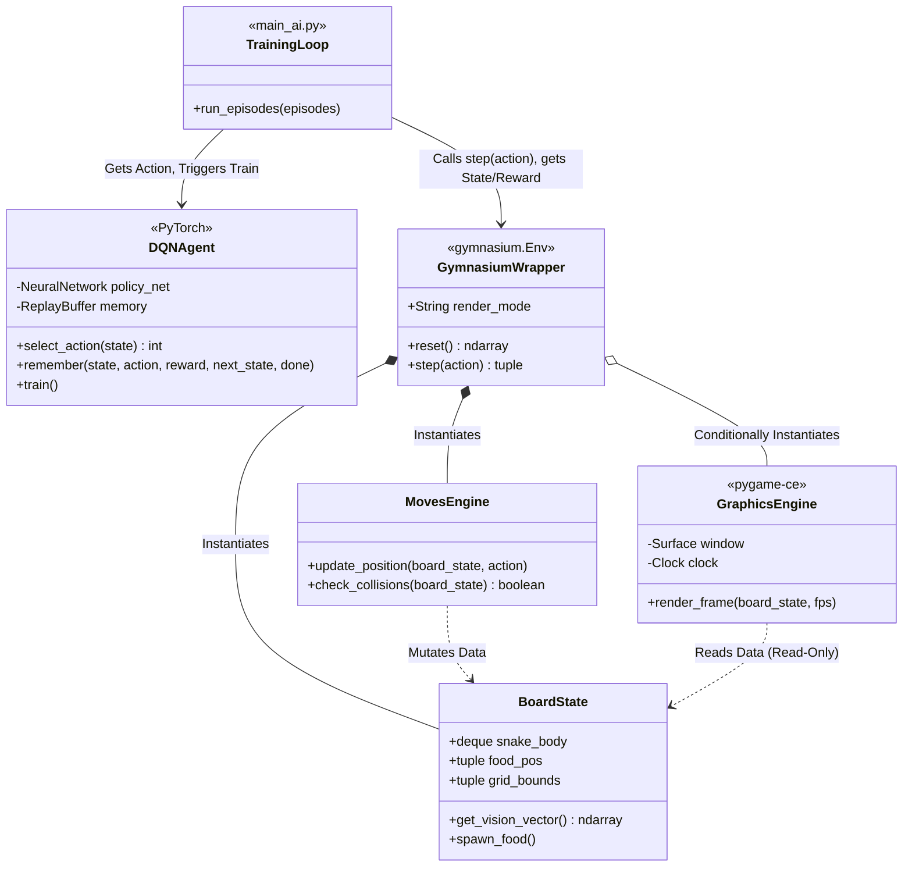

# Learn2Slither

A snake that learns how to behave in an environment through trial and error.

## Current Architecture Vision

```mermaid
classDiagram
    direction TB

    class TrainingLoop {
        <<main_ai.py>>
        +run_episodes(episodes)
    }

    class DQNAgent {
        <<PyTorch>>
        -NeuralNetwork policy_net
        -ReplayBuffer memory
        +select_action(state) int
        +remember(state, action, reward, next_state, done)
        +train()
    }

    class GymnasiumWrapper {
        <<gymnasium.Env>>
        +String render_mode
        +reset() ndarray
        +step(action) tuple
    }

    class BoardState {
        +deque snake_body
        +tuple food_pos
        +tuple grid_bounds
        +get_vision_vector() ndarray
        +spawn_food()
    }

    class MovesEngine {
        +update_position(board_state, action)
        +check_collisions(board_state) boolean
    }

    class GraphicsEngine {
        <<pygame-ce>>
        -Surface window
        -Clock clock
        +render_frame(board_state, fps)
    }

    %% Training Orchestration Relationships
    TrainingLoop --> DQNAgent : Gets Action, Triggers Train
    TrainingLoop --> GymnasiumWrapper : Calls step(action), gets State/Reward

    %% Environment Composition Relationships
    GymnasiumWrapper *-- BoardState : Instantiates
    GymnasiumWrapper *-- MovesEngine : Instantiates
    GymnasiumWrapper o-- GraphicsEngine : Conditionally Instantiates

    %% Internal Game Engine Data Flow
    MovesEngine ..> BoardState : Mutates Data
    GraphicsEngine ..> BoardState : Reads Data (Read-Only)
```
